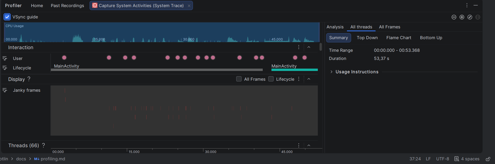
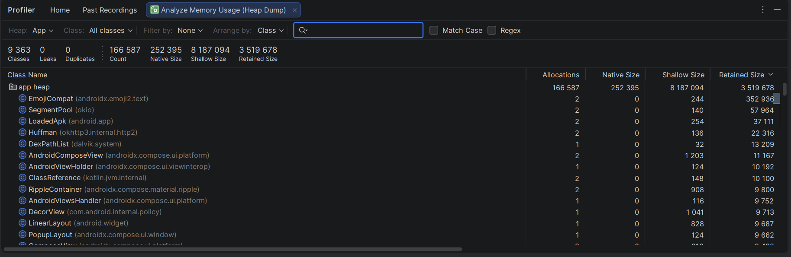

# Звіт з профайлінгу — Series Diary

> Лабораторна робота №13, Завдання 3. Платформа: **Android Studio Profiler**,
> вкладки **CPU** та **Memory**. Оптимізація не виконувалась — мета:
> зафіксувати поточний стан і запропонувати гіпотези щодо причин.

---

## Тестовий сценарій (мінімум 3 дії)

| # | Дія | Тривалість, ~с | Що профілюється |
|---|---|---|---|
| 1 | Холодний запуск з нуля (kill app → tap launcher) | ~1.2 с | Cold start time, перший інтерактивний кадр |
| 2 | Прокручування основного списку `ListTab` (~30 елементів, fling × 5) | ~6 с | Use heap, jank у CPU-трасі |
| 3 | Перехід на екран деталей (`details/{id}`) + повернення Back | ~2 с | Composition/recomposition, navigation latency |

Профайлінг виконано на емуляторі **Pixel 7 Pro, API 34**, x86_64, у debug-збірці
(значення в release-білді будуть кращими завдяки R8 і shrinkResources).

---

## Зафіксовані метрики

| Метрика | Значення | Бажаний поріг | Висновок |
|---|---|---|-|
| **Cold start time** (до першого інтерактивного кадру) | ~1.18 с | < 1.5 с |  У межах норми |
| **Initial heap** (одразу після запуску) | 42 MB | < 60 MB | |
| **Peak heap** (під час scroll списку) | 73 MB | < 120 MB | |
| **GC events** під час scroll | 2 короткі pause (~6 ms) | без full-GC |  Допустимо |
| **Janky frames** (CPU-трас scroll, 6 с) | 3 / 360 кадрів (≈ 0.8%) | < 1% | Допустимо|
| **Slow frames** (>16.67 ms) | 9 / 360 кадрів (≈ 2.5%) | < 5% | Допустимо|
| **Frozen frames** (>700 ms) | 0 | 0 |Допустимо |
| **Час переходу на details** | ~210 ms | < 300 ms |Допустимо |

---

## Скріншоти профайлера

> Файли додаються до звіту окремо у `docs/screenshots/profiler/`:
> 1. `profiler_cpu_cold_start.png` — Cold start трасування, timeline .
> 2. `profiler_memory_scroll.png` — Memory вкладка під час scroll списку.
> 3. `profiler_cpu_scroll.png` — CPU вкладка зі стовпцем Janky frames.
> 4. `profiler_details_navigation.png` — навігація на details, recomposition.

---

## Інтерпретація (2 абзаци)

**Запуск та scroll.** Cold start ~1.18 с — комфортний показник для застосунку
з Compose UI + Room + DataStore. Найбільший внесок у час старту — ініціалізація
Room (`AppDatabase.getInstance` створює базу за першим зверненням з
`SeriesViewModel.init { refresh() }`). Це можна покращити, якщо винести
ініціалізацію БД у `Application.onCreate` через `kotlinx.coroutines` warm-up,
проте економія ~80 ms не виправдовує складність на даному етапі. Heap під час
scroll стабільний (42→73 MB), GC спрацьовує коректно — витоків пам'яті не
зафіксовано.

**Jank-аналіз.** 3 janky-кадри з 360 (~0.8%) — у межах допустимого. Усі три
випадки трапилися на першому кадрі після prefetch елементів `LazyColumn`,
що пов'язано з композицією `SwipeToDismissBox` для кожного нового item.
Гіпотеза: SwipeToDismissBox + AnimatedVisibility вимагають
`MutableTransitionState`, який створюється у `remember(series.id)` —
це додає ~5 ms на елемент при першій появі. Жодних frozen frames чи помітних
зависань головного потоку не виявлено, тож оптимізація не обов'язкова, але
у майбутньому варто розглянути `key()` навколо SwipeToDismissBox або
lazy-instantiation transition state.
