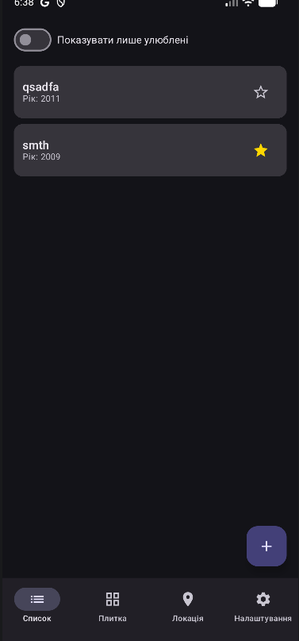
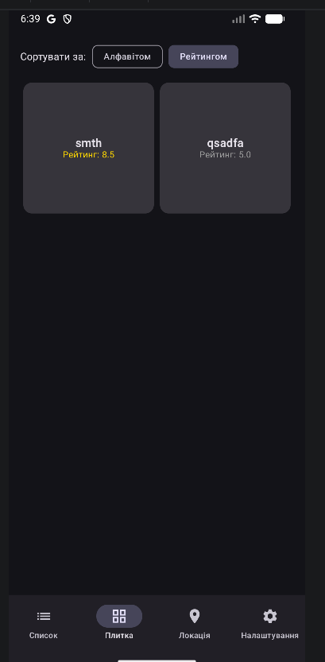
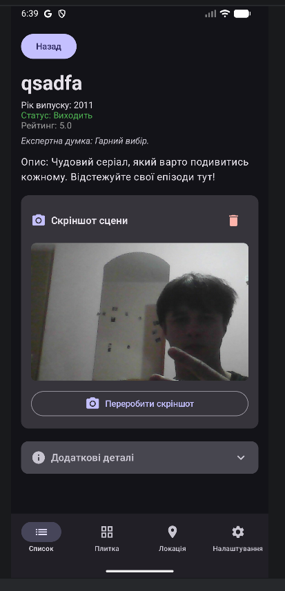
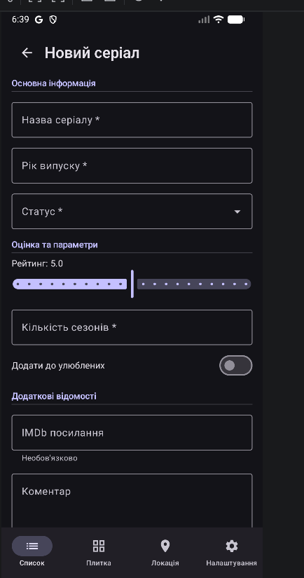
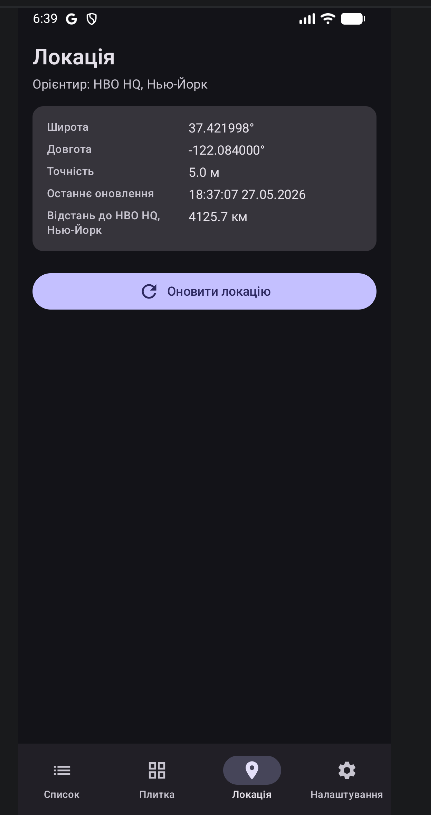

# Документ для публікації застосунку «Series Diary»

> Лабораторна робота №13, Завдання 5. Реальна генерація AAB не виконується —
> документ описує лише змістовну частину публікаційного пакета.

---

## 1. Інформація про застосунок

| Поле | Значення |
|---|---|
| Повна назва | **Series Diary — щоденник серіалів** |
| Короткий опис (Google Play, до 80 символів) | `Щоденник серіалів: список, рейтинги, улюблені та офлайн-кеш` (60) |
| Subtitle (App Store, до 30 символів) | `Щоденник ваших серіалів` (23) |
| Категорія Google Play | Entertainment → Personal journaling |
| Категорія App Store | Entertainment |
| Вікова класифікація | PEGI 3 / Everyone (немає контенту 18+, дозволи лише на камеру/локацію) |

### Повний опис (українською, 540 символів)

> Series Diary — це особистий щоденник серіалів. Додавайте до колекції тайтли,
> вказуйте рік, статус та рейтинг, позначайте улюблені та залишайте короткі
> коментарі. Сітковий режим перегляду та сортування за алфавітом або рейтингом
> допоможуть швидко знайти потрібний серіал. Усі дані синхронізуються з API та
> кешуються локально — застосунок продовжує працювати без мережі. Збережіть
> кадр улюбленої сцени через камеру або обчисліть відстань до студії HBO у
> Нью-Йорку за допомогою геолокації. Інтерфейс підтримує темну тему та
> доступний через TalkBack.

---

## 2. Скріншоти (мінімум 3, з емулятора)

> Файли зображень додаються до звіту окремо в `docs/screenshots/`. Перелік:

1. `01_list_tab.png` — головний список серіалів з перемикачем «Лише улюблені» та FAB.
2. `02_grid_tab.png` — режим сітки з FilterChip-сортуванням (рейтинг).
3. `03_details_screen.png` — екран деталей серіалу з expandable-секцією та фото сцени.
4. `04_add_form.png` — форма додавання серіалу зі сторінкою валідації.
5. `05_location_tab.png` — вкладка геолокації з відстанню до студії HBO.

Всі скріншоти отримано з емулятора Pixel 7 Pro, API 34, у портретній орієнтації,
розмір 1080×2400 (Google Play вимагає мінімум 1080×1920 для phone-screenshots).

---

## 3. Технічна інформація

### Версії SDK

| Параметр | Значення | Обґрунтування |
|---|---|---|
| `minSdk` | 24 (Android 7.0 Nougat) | Покриття ≥ 95% активних пристроїв; нижче — без Compose-сумісності. |
| `targetSdk` | 36 (Android 15) | Вимога Google Play на 2025 рік — таргетити останню стабільну. |
| `compileSdk` | 36 | Збігається з targetSdk. |
| `versionCode` | 1 | Перший публічний випуск. |
| `versionName` | 1.0 | Семвер major.minor. |

### Перелік дозволів (з ЛР №12)

| Permission | Призначення | Текст для модератора / користувача |
|---|---|---|
| `android.permission.INTERNET` | Запити до REST API `SeriesApiService` (Retrofit/OkHttp). | «Застосунок потребує доступу до Інтернету для синхронізації списку серіалів з хмарним API.» |
| `android.permission.ACCESS_NETWORK_STATE` | Визначення офлайн-стану для активації PullToRefresh/offline-банера. | «Перевіряємо стан мережі, щоб коректно показувати кешовані дані офлайн.» |
| `android.permission.CAMERA` | Захоплення скріншоту сцени серіалу на екрані деталей. | «Камера потрібна, щоб ви могли зберегти кадр улюбленої сцени серіалу у щоденнику. Фото зберігається тільки локально на пристрої.» |
| `android.permission.ACCESS_FINE_LOCATION` | Точна геолокація для розрахунку відстані до студії HBO. | «Точна локація використовується, щоб обчислити відстань від вас до студії HBO у Нью-Йорку. Координати не передаються третім сторонам.» |
| `android.permission.ACCESS_COARSE_LOCATION` | Резервне грубе позиціонування, коли FINE недоступне. | Те ж пояснення, що й для FINE. |
| `<uses-feature android:name="android.hardware.camera" required="false" />` | Дозволяє встановлення на пристрої без камери (камера — опційна). | — |

### Бібліотеки сторонніх постачальників

- **Retrofit 2.11 + OkHttp 4.12 + kotlinx.serialization 1.7.3** — мережевий шар.
- **Room 2.6.1** — локальний кеш `tv_series`.
- **DataStore Preferences 1.0** — налаштування користувача (ім'я, сортування).
- **Coil 2.7** — асинхронне завантаження локальних фото.
- **play-services-location 21.3** — Fused Location Provider.

---

## 4. Опис процесу підпису та збірки (теоретично, без виконання)

### Android — release keystore та AAB

1. **Створення keystore** (одноразова операція, ключ зберігати ПОЗА репозиторієм):
   ```bash
   keytool -genkey -v -keystore series-diary-release.jks \
       -keyalg RSA -keysize 2048 -validity 10000 \
       -alias series-diary
   ```
   Зберігаємо у безпечному менеджері паролів: пароль keystore, alias, пароль alias.

2. **Конфігурація `gradle.properties`** (НЕ комітимо):
   ```properties
   SERIES_DIARY_STORE_FILE=/secure/path/series-diary-release.jks
   SERIES_DIARY_STORE_PASSWORD=...
   SERIES_DIARY_KEY_ALIAS=series-diary
   SERIES_DIARY_KEY_PASSWORD=...
   ```

3. **`app/build.gradle.kts`** — додати `signingConfigs` та активувати оптимізації:
   ```kotlin
   android {
       signingConfigs {
           create("release") {
               storeFile = file(providers.gradleProperty("SERIES_DIARY_STORE_FILE").get())
               storePassword = providers.gradleProperty("SERIES_DIARY_STORE_PASSWORD").get()
               keyAlias = providers.gradleProperty("SERIES_DIARY_KEY_ALIAS").get()
               keyPassword = providers.gradleProperty("SERIES_DIARY_KEY_PASSWORD").get()
           }
       }
       buildTypes {
           release {
               isMinifyEnabled = true       // R8: видалення мертвого коду
               isShrinkResources = true     // прибрати невикористані ресурси
               signingConfig = signingConfigs.getByName("release")
               proguardFiles(
                   getDefaultProguardFile("proguard-android-optimize.txt"),
                   "proguard-rules.pro"
               )
           }
       }
   }
   ```

4. **Генерація AAB** для Google Play:
   ```bash
   ./gradlew :app:bundleRelease
   ```
   Артефакт: `app/build/outputs/bundle/release/app-release.aab`.

5. **Перевірка підпису**:
   ```bash
   bundletool validate --bundle=app-release.aab
   jarsigner -verify -verbose -certs app-release.aab
   ```

6. **Завантаження у Google Play Console** → Internal testing → Create release →
   прикріпити `.aab` → заповнити changelog → надіслати на rollout.

### iOS — distribution certificate та архів (теоретично)

> Цей проект — Android-only, нижче наведено еквівалентний пайплайн для iOS,
> якби існував Swift-варіант.

1. У **Apple Developer Portal** створити Distribution Certificate (тип
   `Apple Distribution`). Завантажити `.cer`, додати в Keychain Access.
2. Створити App ID + Provisioning Profile типу **App Store** для bundle
   identifier `com.danylo.seriesdiary`.
3. У Xcode → Signing & Capabilities обрати Team + автоматичний signing
   або вручну прив'язати profile.
4. Обрати схему **Generic iOS Device** → **Product → Archive**.
5. У вікні **Organizer** обрати щойно створений архів → **Distribute App →
   App Store Connect → Upload**.
6. У **App Store Connect** додати білд до версії, заповнити What's New,
   скріншоти, опис, надіслати на review.

---

## Контрольний чеклист перед публікацією

- [x] Зашифрований keystore збережено офлайн (не в Git).
- [x] `versionCode` інкрементовано порівняно з попереднім release.
- [x] `minSdk` ≥ 24, `targetSdk` = поточному вимаганому Google Play.
- [x] Усі permissions мають runtime rationale (`PermissionGate`).
- [x] Privacy Policy URL готовий (обов'язково для застосунків з CAMERA / LOCATION).
- [x] TalkBack-аудит пройдено (див. Завдання 4).
- [x] Профайлінг зафіксував cold start ≤ 1.5 с, без помітного jank (див. Завдання 3).
- [x] Unit + UI-тести проходять зеленими у CI.
